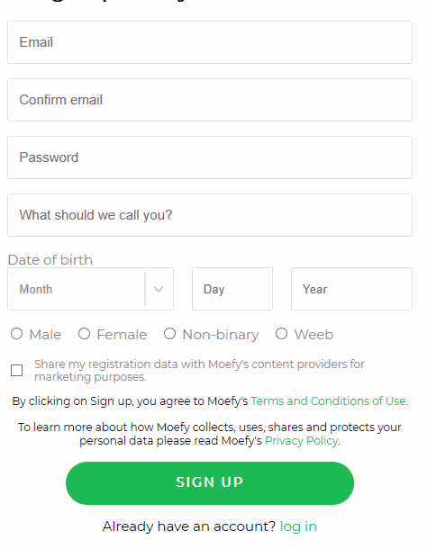
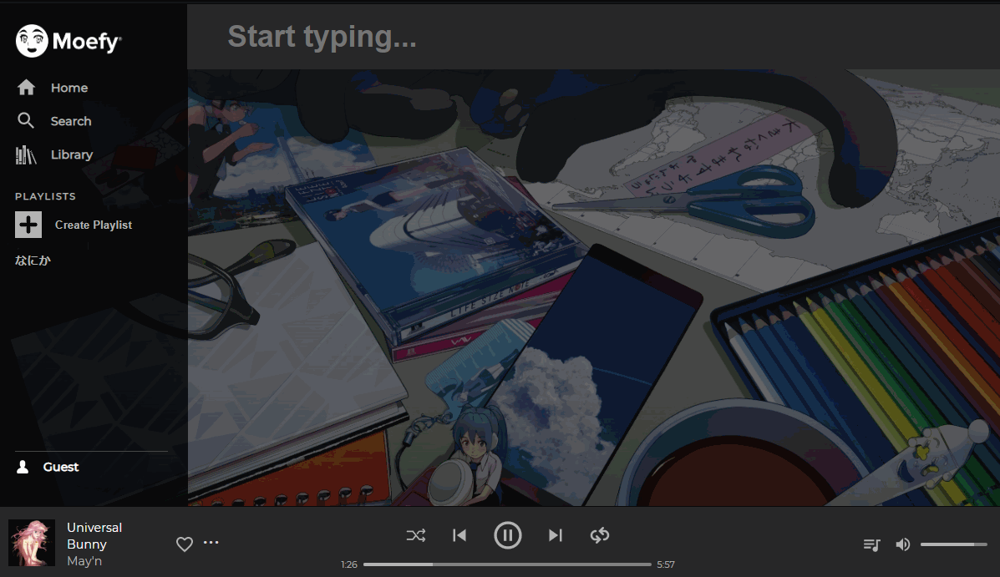

# Moefy


[Live](https://moefy.herokuapp.com/#/)
## Overview
Moefy is an anime themed Spotify clone where catchy songs accompany colorful backgrounds. If anime isn't your thing you might just aquire a new taste!

## Features:
### Responsive User Authentication
Using a series of onBlur event actions, the input fields come to life and reminds a user if they missed an input field or if they typed something invalid.



The logic behind it involves multiple conditionals and toggling the display attribute.
```javascript
renderEmailError(){
    if (this.state.email_validation && !this.validateEmail(this.state.email) && this.props.formType === "signup") {
        this.addRedBorder("email")
        return (
                <label className="error" id="email-error">The email address you supplied is invalid.</label>
        );
    }

    if (this.state.email_validation && this.state.email.length < 1 && this.props.formType === "login") {
        this.addRedBorder("email")
        return (
            <label className="error">Please enter your Spotify username or email address.</label>
        );
    }

    if(this.state.email) this.removeRedBorder('email')
    return <label className="error hidden" id="email-error"></label>
}
```
This was challenging in that my first implementation involved deleting html elements and adding new ones whenever a new error shows up. The problem was that deleting elements relies on a parentnode/wrapper. When a user hits signup, the page rerenders and the relationship between each tags are lost. This resulted in the accumulation of error message labels without them getting removed. 

The simpler way was just to edit an persistent element. An onBlur event listener updates the "validate" state accordingly and either removes the red borders/error messages or adds them. When a user ignores the errors and hits sign up, these errors are replaced with errors coming from the database. It uses the same label containers and just repaints their text.


### Stylish and functional sliders


It was frustrating to find out that a range input would be so basic. You could not style either sides of the range bar to be different colors. The trick was to super impose the input bar on top of the progress bar which tracks the overall volume. The input bar is hidden and the bar itself is removed so only a customized thumb remains. When a user hovers on the progress bar the thumb of the input bar appears. Pressing the speaker bar mutes and saves the previous level. Its icon changes depending on the level as well.
```html
<label className="volume-left" onClick={this.handleMute}>{muteButton}</label>
<div className="volume-right">
    <div className="volume-bar"><input type='range' min={0} max={1} step='any' value={volume} onChange={this.handleVolumeChange} /></div>
    <progress max={1} value={volume} />
</div>
```

### Continous Playback

No matter which page a user navigates the music won't stop playing. The queue is built from where a user hits play. Can also go back a track or forward as well as see what's ahead.

```javaScript
    handleClicks(e){
        let pickedSongId = e.target.closest("li").id
        let queue = this.queueConstructor(pickedSongId)
        this.props.playQueue(queue)
        this.props.currentSong(pickedSongId)
    }

    queueConstructor(songId){
        let songList = this.state.songList
        let index = songList.indexOf(parseInt(songId))
        return songList.slice(index)
    }
```

### Playlist and Likes


Like songs, Create playlist and keep track of your favorite songs!


### Search


Search from Artist, albums, or songs! RegExp is used to filter the Redux store and display the results.

```javaScript
    onInputChange(e){
        let searchTerm = e.target.value
        let displayedSongs = this.props.songs.filter(song => song.name.match(new RegExp(searchTerm, "i")))
        let displayedAlbums = this.props.albums.filter(album => album.name.match(new RegExp(searchTerm, "i")))
        let displayedArtists = this.props.artists.filter(artist => artist.name.match(new RegExp(searchTerm, "i")))
        this.setState({
            searchTerm: searchTerm,
            displayedSongs: displayedSongs,
            displayedAlbums: displayedAlbums,
            displayedArtists: displayedArtists
        })
    }
```


